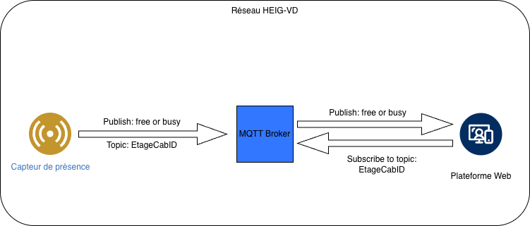

# Cab-In - IoT Projet 2026

Cab-In est une plateforme web permettant de voir l'utilisation des cabines présentes dans les étages du bâtiment de la HEIG-VD à Yverdon.
Elle utilise des capteurs de présence installés dans chaque cabine indiquant si elle est libre ou occupée.

## Architecture

## Technologies utilisées

